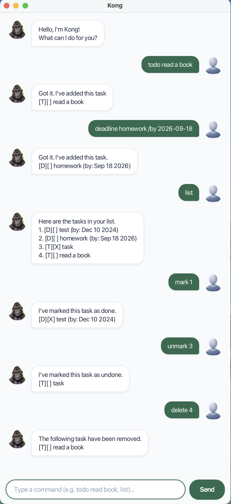

# Kong User Guide

Kong is a desktop task-tracking chatbot designed to help you organize your daily tasks, deadlines, and events. Featuring an interactive chat interface optimized for fast command-line typing, Kong keeps your schedule neatly ordered and automatically saved.



----------------------------------------------------------------------------------------------------

## Quick Start

1. Ensure that **Java 25** is installed on your computer.
2. Launch Kong. The chat window will open and display Kong's greeting.
3. Type a command in the input box at the bottom and press **Enter** (or click **Send**) to execute it.
4. Try out some simple commands:
   * `todo read book` : Adds a new to-do task.
   * `deadline return book /by 2026-10-15` : Adds a deadline due on 15 Oct 2026.
   * `list` : Lists all tasks currently in your list.
   * `bye` : Exits the application.
5. Refer to the [Features](#features) section below for detailed instructions on each command.

----------------------------------------------------------------------------------------------------

## Features

> **Notes about the command format:**
>
> * Words in `<angle brackets>` are parameters to be supplied by the user.  
>   For example, in `todo <description>`, `<description>` can be `read book`.
> * Dates must follow the strict `yyyy-MM-dd` format (e.g., `2026-10-15`). Calendar dates that do not exist (e.g., `2026-02-30`) are rejected.
> * Task descriptions cannot contain the vertical bar `|` character or newline characters.
> * Tasks are automatically ordered **chronologically**: deadlines and events are sorted by date, while undated to-dos appear at the end.
> * Commands taking no arguments (`list`, `bye`) reject extraneous input.
> * Duplicate tasks (identical task type, description, and dates) are automatically rejected to prevent duplicates.

### Adding a to-do task: `todo`

Adds a general task without any date or time constraints.

* **Format:** `todo <description>`
* **Example:** `todo read book`

**Expected Outcome:**
```text
Got it. I've added this task
[T][ ] read book
```

---

### Adding a deadline: `deadline`

Adds a task that must be completed by a specific date.

* **Format:** `deadline <description> /by <date>`
* **Date Format:** `yyyy-MM-dd`
* **Example:** `deadline return book /by 2026-10-15`

**Expected Outcome:**
```text
Got it. I've added this task.
[D][ ] return book (by: Oct 15 2026)
```

---

### Adding an event: `event`

Adds a task that spans a date range from a start date to an end date.

* **Format:** `event <description> /from <start_date> /to <end_date>`  
  *(Alternatively, `/to` can be specified before `/from`: `event <description> /to <end_date> /from <start_date>`)*
* **Date Format:** `yyyy-MM-dd`
* **Note:** The start date cannot be after the end date.
* **Example:** `event project meeting /from 2026-10-15 /to 2026-10-16`

**Expected Outcome:**
```text
Got it. I've added this task.
[E][ ] project meeting (from: Oct 15 2026 to: Oct 16 2026)
```

---

### Listing all tasks: `list`

Displays all current tasks in the list, ordered chronologically with their index numbers and completion statuses.

* **Format:** `list`

**Expected Outcome:**
```text
Here are the tasks in your list.
1. [E][ ] project meeting (from: Oct 15 2026 to: Oct 16 2026)
2. [D][ ] return book (by: Oct 15 2026)
3. [T][ ] read book
```

*(If the task list is empty, Kong displays: `There are currently no tasks in your list.`)*

---

### Marking a task as done: `mark`

Marks the specified task as completed.

* **Format:** `mark <task_number>`
* **Note:** `<task_number>` must be a valid 1-based index from the latest task list.
* **Example:** `mark 2`

**Expected Outcome:**
```text
I've marked this task as done.
[D][X] return book (by: Oct 15 2026)
```

---

### Marking a task as undone: `unmark`

Marks a completed task back to incomplete.

* **Format:** `unmark <task_number>`
* **Example:** `unmark 2`

**Expected Outcome:**
```text
I've marked this task as undone.
[D][ ] return book (by: Oct 15 2026)
```

---

### Finding tasks by keyword: `find`

Searches for tasks whose descriptions contain the given keyword. The search is case-insensitive and matches partial words.

* **Format:** `find <keyword>`
* **Example:** `find book`

**Expected Outcome:**
```text
Here are the matching tasks in your list:
1. [D][ ] return book (by: Oct 15 2026)
2. [T][ ] read book
```

*(If no tasks match, Kong displays: `There are no matching tasks in your list.`)*

---

### Listing tasks on a date: `on`

Lists all deadlines due on the given date and events occurring across that date.

* **Format:** `on <date>`
* **Date Format:** `yyyy-MM-dd`
* **Example:** `on 2026-10-15`

**Expected Outcome:**
```text
Here are the deadlines and events on this date.
1. [E][ ] project meeting (from: Oct 15 2026 to: Oct 16 2026)
2. [D][ ] return book (by: Oct 15 2026)
```

*(If there are no matching tasks on that date, Kong displays: `There are no deadlines or events on this date.`)*

---

### Deleting a task: `delete`

Permanently removes a task from the list at the specified index.

* **Format:** `delete <task_number>`
* **Example:** `delete 1`

**Expected Outcome:**
```text
The following task have been removed.
[E][ ] project meeting (from: Oct 15 2026 to: Oct 16 2026)
```

---

### Exiting the program: `bye`

Exits the chatbot and closes the application window.

* **Format:** `bye`

**Expected Outcome:**
```text
BYEBYE!
```

---

### Automatic data saving and loading

Kong automatically saves your tasks to `data/duke.txt` whenever you add, delete, or change the completion status of a task. The next time you start Kong, it automatically loads your previously saved tasks so you can pick up right where you left off.

----------------------------------------------------------------------------------------------------

## Command Summary

| Action | Format | Example |
|---|---|---|
| **Add To-Do** | `todo <description>` | `todo read book` |
| **Add Deadline** | `deadline <description> /by <date>` | `deadline return book /by 2026-10-15` |
| **Add Event** | `event <description> /from <start_date> /to <end_date>` | `event project meeting /from 2026-10-15 /to 2026-10-16` |
| **List Tasks** | `list` | `list` |
| **Mark Task** | `mark <task_number>` | `mark 2` |
| **Unmark Task** | `unmark <task_number>` | `unmark 2` |
| **Find Tasks** | `find <keyword>` | `find book` |
| **Query Date** | `on <date>` | `on 2026-10-15` |
| **Delete Task** | `delete <task_number>` | `delete 1` |
| **Exit** | `bye` | `bye` |
